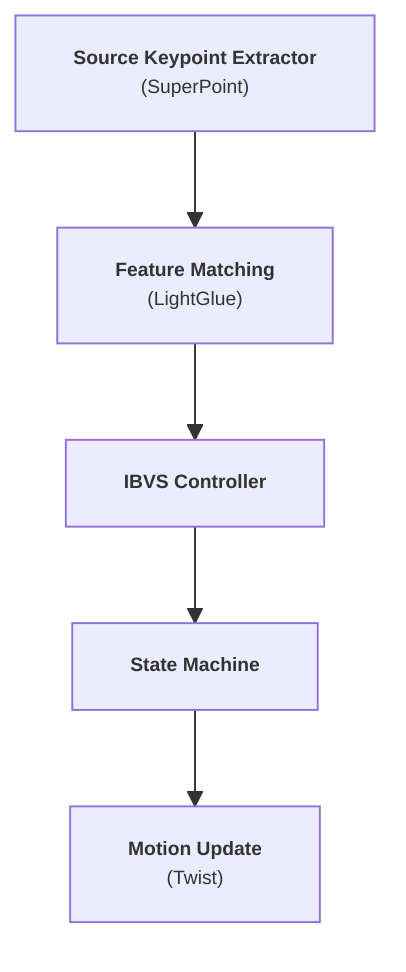
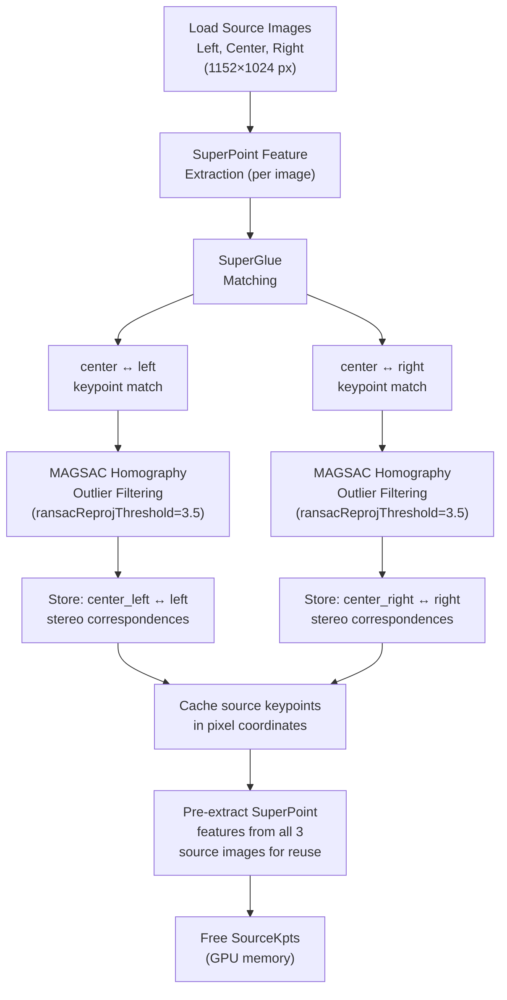
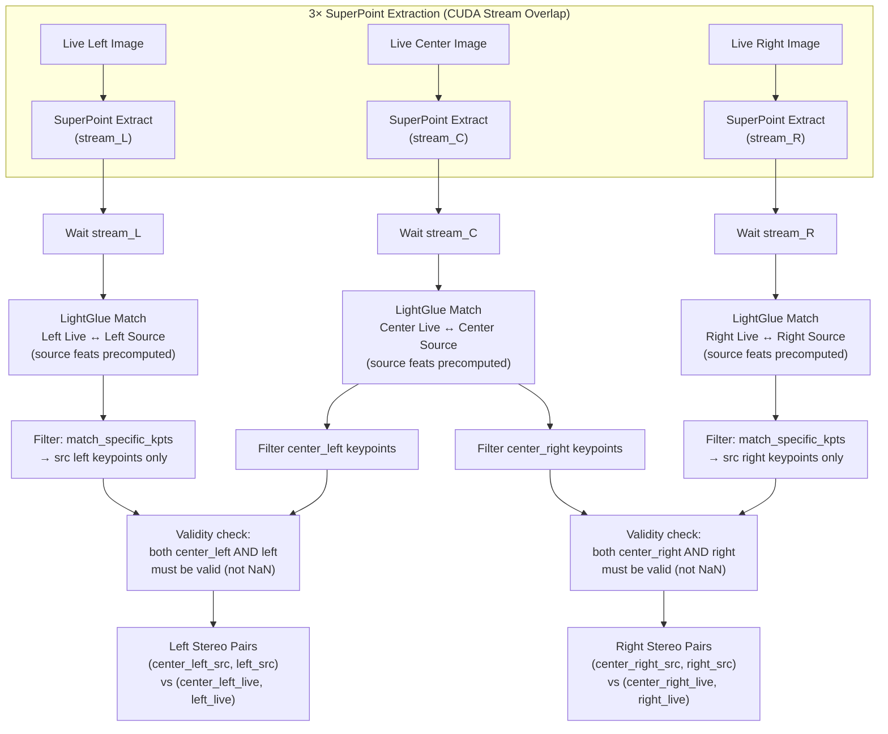

# Visual Servoing Policy

## Input

### Config (One-Time)

| Quantity | Size | Type | Source | Description |
| :--- | :--- | :--- | :--- | :--- |
| 2 | 3×3 + 3×1 each | Extrinsic Matrix | Hardcoded config | R (rotation) and t (translation): side camera optical frame → center camera optical frame |
| 1 | 3x3 | Intrinsic Matrix | Hardcoded config | of three cameras identical |
| 3 | 1152 x 1024 (px) | Source Image | ROS topic | left, middle and right camera |

### Per Iteration

| Quantity | Size | Type | Source | Description |
| :--- | :--- | :--- | :--- | :--- |
| 1 | 3x1 + quaternion | Pose | TF2 | of middle camera’s optical reference to `base_link` |
| 1 | 3x1 | Position | TF2 | gripper/tcp position in `base_link` |
| 3 | 1152 x 1024 (px) | Query Image | ROS topic | left, middle and right camera |

## Output

| Quantity | Size | Type | Description |
| :--- | :--- | :--- | :--- |
| 1 | 6×1 | Controlling Twist `[vx, vy, vz, ωx, ωy, ωz]` | Controlling twist of gripper/TCP expressed in `base_link` frame |

## System Architecture

## Source Images Keypoint Extraction (One-Time)

*Key design*: • SourceKpts uses a separate SuperPoint+SuperGlue instance that is discarded after extraction to free GPU memory. • FeatureMatching then uses a fresh SuperPoint+LightGlue instance for the online matching loop.

## 3. Feature Matching Extraction (Trinocular, per Iteration)

